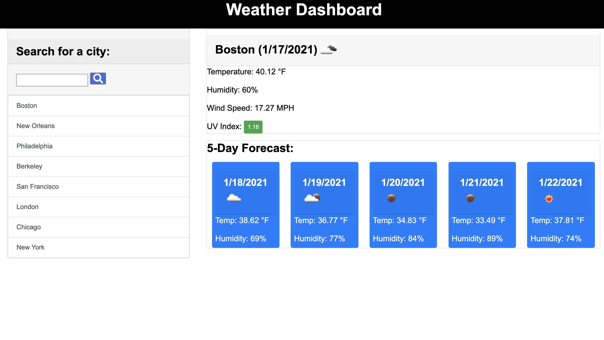

# Weather Dashboard
## by Aaron Rosenblatt
#### I wrote JavaScript, HTML and CSS from scratch to create a weather dashboard that allows a user to see the weather outlook for multiple cities. The app runs in a browser and the JavaScript uses jQuery, Bootstrap, OpenWeather API and the Moment.js library. The weather dashboard displays the current weather for a city typed in the search bar. The display includes the name of the city, the current date, temperature, humidity, wind speed, UV-Index and an icon representing the weather conditions. The UV-Index includes a color that indicates if the current conditions are good, moderate or severe. The display also includes a five-day outlook that displays the date, predicted temperature and humidity, and an icon representing the predicted weather conditions. Below the search bar is a history of each city searched. If a user clicks on a city in the search history, the current weather conditions and a five-day forecast for that city will be displayed.

### The GitHub repository for the Weather Dashboard can be viewed here: https://github.com/noplur/weather-dashboard
### The link to the website of the Weather Dashboard can be viewed here: https://noplur.github.io/weather-dashboard/

### Here is a screenshot of the workday scheduler:
### 